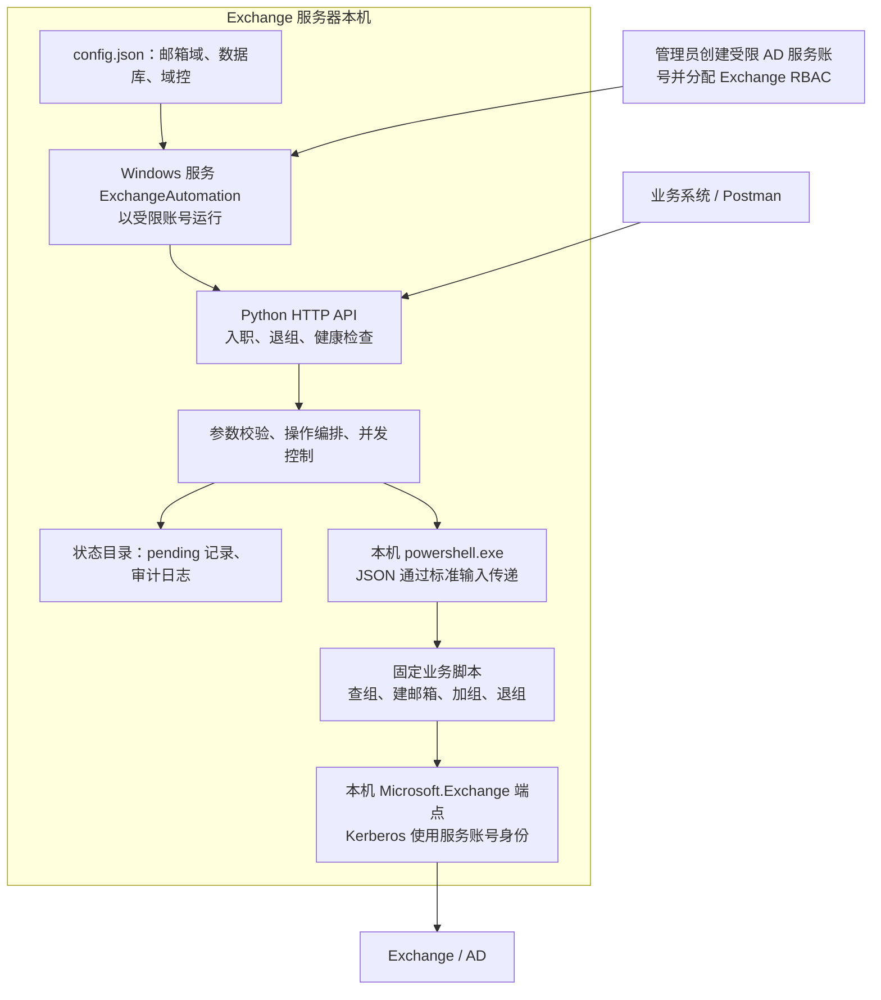

# Exchange 员工邮箱自动化

## 架构与实现流程



服务部署在 Exchange 服务器本机。Python 提供 HTTP API，本机 Windows PowerShell 5.1 连接本机 `Microsoft.Exchange` 端点，并按专用 AD 服务账号的 Exchange RBAC 权限执行操作。

管理员使用 [初始化脚本](deployment/Initialize-ExchangeAutomation.ps1) 创建服务账号和专用角色。Python 服务的手动环境准备、配置与验收见 [Windows 本机服务部署说明](docs/windows-local-service.md)，生产参数模板见 [配置示例](deployment/config.example.json)。

## 目录

```text
exchange_local/       Python API、业务编排和 Windows 服务入口
automation/local/     本机 PowerShell 桥接入口
automation/scripts/   固定的 Exchange 业务操作
deployment/           管理员建号、只读采集脚本和配置示例
tests/python/         Python 回归测试
tests/powershell/     PowerShell 回归测试（模拟，不修改 AD）
docs/                 当前部署、建号和生产信息说明
docs/verification/    当前本机及外部接口验收记录
```

依赖以 `pyproject.toml` 为准。旧 Go、Ansible、Linux 远程直连代码、配置和过时文档已移除，可从 Git 历史恢复。Python、依赖和系统权限由部署人员手动准备，业务服务不会自动安装环境。

## 业务边界

- 入职接口只创建普通 `UserMailbox`；调用前 AD 用户应不存在。AD 用户已存在但没有邮箱时返回冲突。
- 通讯组操作只允许普通静态邮件通讯组 `MailUniversalDistributionGroup`。
- 离职接口只移除直接通讯组成员关系，保留 AD 账号、邮箱和地址。
- 服务账号可在组织范围创建员工邮箱并维护普通通讯组成员，不授予本地管理员、域管理员或 RDP 权限。
- 单实例运行；不同员工默认最多同时处理 2 个请求，同一员工的并发请求返回 409。

## 入职接口

```http
POST /api/exchange/users
Content-Type: application/json

{
  "login_name": "slpeng",
  "display_name": "江流",
  "initial_password": "<new-account-password>",
  "groups": ["app", "dev"]
}
```

| 字段 | 说明 |
|---|---|
| `login_name` | 必填，1–20 位 ASCII；首位为字母或数字，其余允许字母、数字、点、下划线和横线 |
| `display_name` | 必填，最多 256 个字符，不允许控制字符 |
| `initial_password` | 新建账号必填；重试已经存在且完全匹配的邮箱时可省略，不会重置已有密码 |
| `groups` | 可省略或为空；最多 100 项；接受 GUID、SMTP、Alias 或唯一名称，短名称如 `app`、`dev` 可直接使用 |

服务先解析并验证全部组，再创建邮箱。返回 201 表示本次创建，返回 200 表示完全匹配的邮箱已经存在。

```json
{
  "login_name": "slpeng",
  "mailbox_id": "<AD-object-guid>",
  "display_name": "江流",
  "user_principal_name": "slpeng@bjwgby.com",
  "primary_smtp_address": "slpeng@bjwgby.com",
  "created": true,
  "password_applied": true,
  "added_groups": ["app@bjwgby.com"],
  "existing_groups": []
}
```

## 通讯组离职接口

```http
POST /api/exchange/users/slpeng/offboard
```

该接口不接受请求体。重复调用返回空的 `removed_groups`。

```json
{
  "login_name": "slpeng",
  "mailbox_id": "<AD-object-guid>",
  "removed_groups": ["app@bjwgby.com"]
}
```

## 运行与恢复

每次业务操作开始前，服务在配置的 `state_directory` 创建并刷盘 `account-<login_name>.pending` 文件（也识别旧版 `<login_name>.pending`）。操作结果不确定或进程中断时保留该文件，后续对同一员工的请求返回 `OPERATION_STATE_UNKNOWN`。正常停服会等待正在执行的业务结束。

恢复时根据响应中的 `request_id`、服务日志和 Exchange 实际状态核实操作结果。停止服务后，单独移走已经核实的 `.pending` 文件并留作审计，再启动服务重试。不要批量清空状态目录。

常用状态码：

| 状态码 | 场景 |
|---|---|
| 200 / 201 | 成功 / 本次创建成功 |
| 400 / 415 | 参数或 JSON 错误 / Content-Type 错误 |
| 401 | 配置 `api_token` 后凭据缺失或错误 |
| 404 | 邮箱不存在 |
| 409 | 身份冲突、同员工操作中或存在待核查状态 |
| 422 | 通讯组不存在或类型不允许 |
| 429 | 并发容量已满 |
| 503 | 服务正在停止，不接受新业务 |
| 502 / 504 | PowerShell 执行失败或超时；结合 `state_unknown` 判断是否需要核查 |

`GET /healthz` 只表示 Python HTTP 进程存活，不证明 Exchange 会话、数据库和 RBAC 写权限正常。
